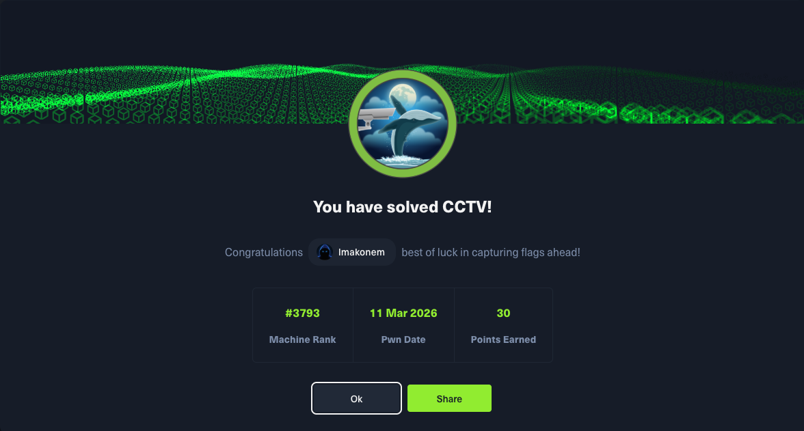

# CCTV - HackTheBox

## Machine Info

| Property | Value |
|----------|-------|
| Name | CCTV |
| OS | Linux |
| Difficulty | Easy |
| Release Date | Season 10 (2026) |
| Status | **Active** |
| IP | 10.129.4.101 |

## Skills Required

- Web Application Enumeration
- Video Surveillance Software Exploitation
- Database Credential Extraction
- Password Cracking
- Linux Privilege Escalation

## Skills Learned

- ZoneMinder filter command injection (v1.37.63)
- MySQL credential extraction from configuration files
- bcrypt hash cracking with John/Hashcat
- motionEye 0.43.1b4 authenticated RCE via config restore
- API signature bypass techniques

## Writeup Status

**This writeup is currently locked as the machine is still active on HackTheBox.**

The full writeup will be available after the machine retires.

| File | Description |
|------|-------------|
| `CCTV_writeup_LOCKED.pdf` | Password-protected PDF |

## Quick Stats

- User Flag: Obtained
- Root Flag: Obtained
- Attack Vector: Web Application + Configuration Abuse
- C2 Callbacks: 4 (www-data, mark, root)

## Attack Path Summary

1. **Enumeration** - Discovered ZoneMinder v1.37.63 on port 80
2. **Initial Access** - Default credentials (admin:admin) on ZoneMinder
3. **RCE as www-data** - Filter AutoExecuteCmd command injection
4. **Credential Extraction** - MySQL credentials from /etc/zm/zm.conf
5. **Database Dump** - Extracted user password hashes from ZoneMinder Users table
6. **Password Cracking** - Cracked mark's bcrypt hash with rockyou.txt
7. **Lateral Movement** - SSH as mark
8. **Privilege Escalation** - motionEye config restore vulnerability to execute commands as root

## Services Discovered

| Port | Service | Details |
|------|---------|---------|
| 22 | SSH | OpenSSH 9.6p1 Ubuntu |
| 80 | HTTP | Apache 2.4.58 - ZoneMinder v1.37.63 |
| 8765 | HTTP | motionEye 0.43.1b4 (localhost only) |

## Credentials Obtained

| Service | Username | Source |
|---------|----------|--------|
| ZoneMinder | admin | Default credentials |
| MySQL | zmuser | /etc/zm/zm.conf |
| SSH | mark | Cracked from database hash |
| motionEye | admin | /etc/motioneye/motion.conf |

## Tags

`web` `zoneminder` `motioneye` `cctv` `surveillance` `mysql` `bcrypt` `ssh` `config-restore` `rce`
