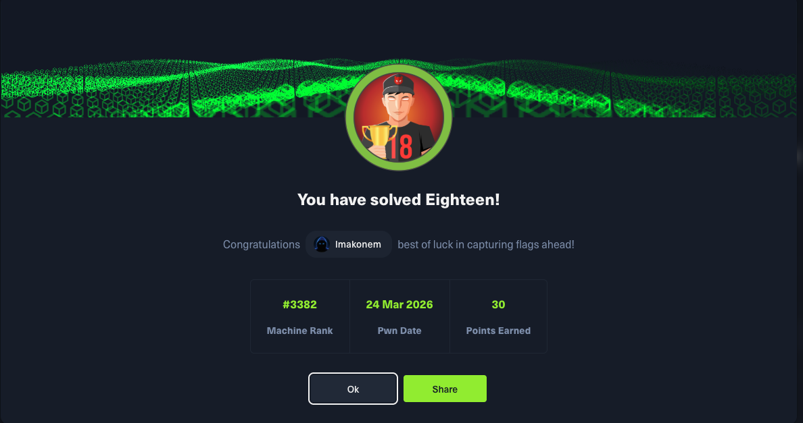

# Eighteen - HackTheBox

## Machine Info

| Property | Value |
|----------|-------|
| Name | Eighteen |
| OS | Windows Server 2025 (Active Directory) |
| Difficulty | Easy |
| Release Date | Season 10 (2026) |
| Status | **Active** |
| IP | 10.129.14.0 (current instance) |

## Skills Required

- MSSQL Enumeration and Exploitation
- SQL Impersonation Chaining
- Password Cracking (PBKDF2-SHA256)
- Active Directory Enumeration
- Windows Privilege Escalation

## Skills Learned

- MSSQL login impersonation (`EXECUTE AS LOGIN`) to access restricted databases
- PBKDF2:SHA256 hash cracking with hashcat
- Password spraying across AD accounts via WinRM
- Delegated Managed Service Account (dMSA) abuse via BadSuccessor attack
- Impacket `getST.py` with `-dmsa` flag for S4U2Self ticket impersonation
- LDAP signing bypass using Impacket's native `LDAPConnection` (vs ldap3)
- Chisel SOCKS proxy tunneling to reach filtered AD ports
- DCSync via `secretsdump.py` for domain admin hash extraction

## Writeup Status

**This writeup is currently locked as the machine is still active on HackTheBox.**

The full writeup will be available after the machine retires.

| File | Description |
|------|-------------|
| `Eighteen_writeup_LOCKED.pdf` | Password-protected PDF |

## Quick Stats

- User Flag: Obtained
- Root Flag: Obtained
- Attack Vector: MSSQL Impersonation -> Password Spray -> dMSA Abuse (BadSuccessor) -> DCSync
- Pivots Required: 2 (kevin SQL -> adam.scott user -> Administrator via dMSA)
- CVEs Used: None (misconfiguration-based)

## Attack Path Summary

1. **Enumeration** - Nmap reveals HTTP (80), MSSQL (1433), and WinRM (5985) on DC01.eighteen.htb
2. **MSSQL Exploitation** - Login as `kevin` with provided creds, impersonate `appdev` login to access `financial_planner` database
3. **Credential Cracking** - Dump users table containing PBKDF2-SHA256 admin hash, crack to `iloveyou1`
4. **User Access** - Password spray finds `adam.scott:iloveyou1` works on WinRM (member of IT group)
5. **AD Enumeration** - IT group has `CreateChild` on `OU=Staff` allowing object creation
6. **Privilege Escalation** - Create delegated Managed Service Account (dMSA) targeting Administrator via BadSuccessor attack
7. **Domain Admin** - Use `getST.py -dmsa` for S4U2Self ticket, then DCSync with `secretsdump.py` to extract Administrator NTLM hash
8. **Root** - Pass-the-hash with evil-winrm as Administrator

## Services Discovered

| Port | Service | Details |
|------|---------|---------|
| 80 | HTTP | IIS - Default page |
| 1433 | MSSQL | Microsoft SQL Server 2022 |
| 5985 | WinRM | Microsoft HTTPAPI httpd 2.0 |
| 88 | Kerberos | Filtered from external, accessible via tunnel |
| 389 | LDAP | Filtered from external, accessible via tunnel |
| 445 | SMB | Filtered from external, accessible via tunnel |

## Domains

- `eighteen.htb` - Domain root
- `DC01.eighteen.htb` - Domain Controller

## Credentials Obtained

| Service | Username | Source |
|---------|----------|--------|
| MSSQL | kevin | Provided starting credentials |
| MSSQL | appdev | SQL impersonation from kevin |
| WinRM | adam.scott | Password spray with cracked hash (`iloveyou1`) |
| WinRM | Administrator | DCSync via dMSA abuse (pass-the-hash) |

## Key Vulnerabilities

| Issue | Component | Description |
|-------|-----------|-------------|
| SQL Impersonation | MSSQL | kevin login can impersonate appdev to access financial_planner DB |
| Weak Password | Web App | Admin PBKDF2 hash cracks to common password `iloveyou1` |
| Password Reuse | AD | adam.scott reuses cracked web app password for domain account |
| Excessive ACL | Active Directory | IT group has CreateChild on Staff OU (all object types) |
| dMSA Abuse (BadSuccessor) | Active Directory | CreateChild allows dMSA creation targeting any principal for privilege escalation |

## Tags

`windows` `easy` `active-directory` `mssql` `impersonation` `password-spray` `dmsa` `badsuccessor` `dcsync` `winrm` `kerberos`
