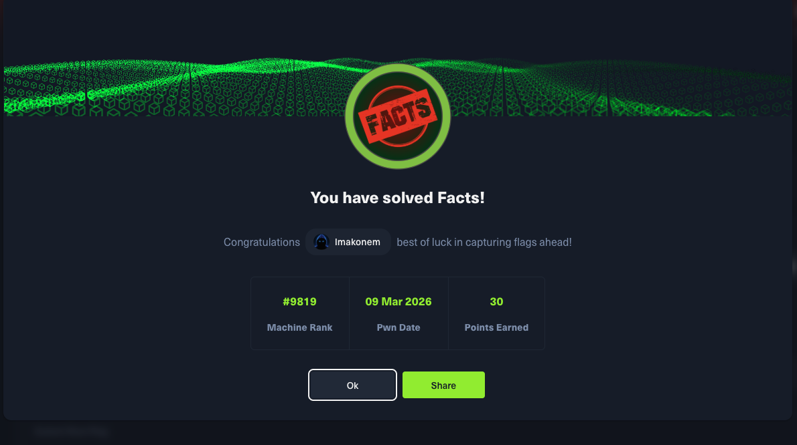

# Facts - HackTheBox

## Machine Info

| Property | Value |
|----------|-------|
| Name | Facts |
| OS | Linux |
| Difficulty | Easy |
| Release Date | Season 10 (2026) |
| Status | **Active** |
| IP | 10.129.3.3 |

## Skills Required

- Web Application Enumeration
- CMS Exploitation
- Path Traversal Vulnerabilities
- S3/MinIO Bucket Enumeration
- SSH Key Cracking
- Linux Privilege Escalation

## Skills Learned

- Camaleon CMS mass assignment for role escalation
- CVE-2024-46987 path traversal exploitation
- MinIO S3 bucket enumeration and credential extraction
- SQLite database analysis
- SSH private key passphrase cracking with John
- Facter custom facts for privilege escalation

## Writeup Status

**This writeup is currently locked as the machine is still active on HackTheBox.**

The full writeup will be available after the machine retires.

| File | Description |
|------|-------------|
| `Facts_writeup_LOCKED.pdf` | Password-protected PDF |

## Quick Stats

- User Flag: Obtained
- Root Flag: Obtained
- Attack Vector: Web CMS + Cloud Storage + SSH
- CVEs Used: CVE-2024-46987

## Attack Path Summary

1. **Enumeration** - Discovered Camaleon CMS 2.9.0 and MinIO on port 54321
2. **Role Escalation** - Mass assignment vulnerability to gain admin access
3. **Path Traversal** - CVE-2024-46987 to read arbitrary files
4. **Credential Extraction** - S3 keys from SQLite database
5. **SSH Key Recovery** - Downloaded encrypted SSH key from MinIO bucket
6. **Key Cracking** - Passphrase cracked with rockyou.txt
7. **Initial Access** - SSH as user `trivia`
8. **Privilege Escalation** - Sudo facter with custom Ruby facts

## Services Discovered

| Port | Service | Details |
|------|---------|---------|
| 22 | SSH | OpenSSH 9.9p1 Ubuntu |
| 80 | HTTP | nginx 1.26.3 - Camaleon CMS 2.9.0 |
| 54321 | HTTP | MinIO S3-compatible storage |

## Tags

`web` `cms` `camaleon` `path-traversal` `cve-2024-46987` `minio` `s3` `ssh` `john` `facter` `ruby`
