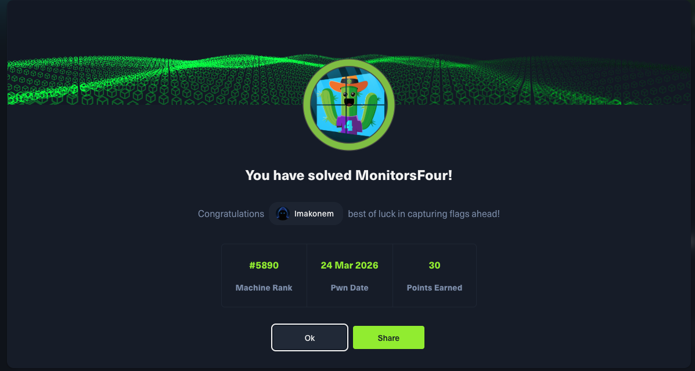

# MonitorFour - HackTheBox

## Machine Info

| Property | Value |
|----------|-------|
| Name | MonitorFour |
| OS | Windows (Docker Desktop / WSL2) |
| Difficulty | Medium |
| Release Date | Season 10 (2026) |
| Status | **Active** |
| IP | 10.129.13.253 (current instance) |

## Skills Required

- Web Application Enumeration
- API Endpoint Discovery
- CVE Research and Exploitation
- Docker Container Escape

## Skills Learned

- IDOR exploitation via API endpoint with token=0 bypass
- Cacti 1.2.28 RCE via CVE-2025-24367 (graph template command injection)
- Docker Desktop container escape via CVE-2025-9074 (unauthenticated Docker API)
- Host filesystem mount from within Docker container

## Writeup Status

**This writeup is currently locked as the machine is still active on HackTheBox.**

The full writeup will be available after the machine retires.

| File | Description |
|------|-------------|
| `MonitorFour_writeup_LOCKED.pdf` | Password-protected PDF |

## Quick Stats

- User Flag: Obtained
- Root Flag: Obtained
- Attack Vector: IDOR -> Cacti RCE -> Docker Escape
- Pivots Required: 2 (www-data in container -> user flag -> root via Docker API)
- CVEs Used: CVE-2025-24367, CVE-2025-9074

## Attack Path Summary

1. **Enumeration** - Nmap reveals HTTP (80) and WinRM (5985), discover monitorsfour.htb and cacti.monitorsfour.htb subdomain
2. **IDOR** - API endpoint /user?token=0 leaks all user credentials with MD5 hashes
3. **Credential Cracking** - Admin hash cracks to `wonderful1`, login as `marcus:wonderful1` on Cacti
4. **Initial Access (www-data)** - Exploit Cacti 1.2.28 CVE-2025-24367 (graph template RCE) for reverse shell into Docker container
5. **User Flag** - Read /home/marcus/user.txt from within container (world-readable)
6. **Privilege Escalation (root)** - Discover Docker API at 192.168.65.7:2375 (CVE-2025-9074), create container mounting host C: drive, read root flag

## Services Discovered

| Port | Service | Details |
|------|---------|---------|
| 80 | HTTP | nginx - MonitorsFour corporate site + Cacti 1.2.28 |
| 5985 | WinRM | Microsoft HTTPAPI httpd 2.0 |

## Domains

- `monitorsfour.htb` - Main corporate website
- `cacti.monitorsfour.htb` - Cacti network monitoring (v1.2.28)

## Credentials Obtained

| Service | Username | Source |
|---------|----------|--------|
| Cacti | marcus | IDOR /user?token=0 + MD5 crack (wonderful1) |

## Key Vulnerabilities

| CVE | Component | Description |
|-----|-----------|-------------|
| CVE-2025-24367 | Cacti <= 1.2.28 | RCE via command injection in graph template rrdtool fields |
| CVE-2025-9074 | Docker Desktop | Unauthenticated Docker Engine API accessible from containers on 192.168.65.7:2375 |

## Tags

`windows` `medium` `web` `idor` `cacti` `docker` `container-escape` `cve` `rce` `winrm`
